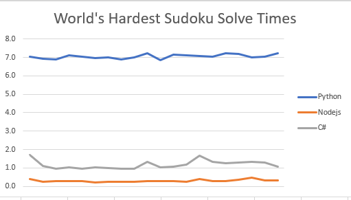

# Sudoku Solver 
Using [Backtracking](https://en.wikipedia.org/wiki/Backtracking)

## World's Hardest Sudoku
[Provided by Telegraph.co](https://www.telegraph.co.uk/news/science/science-news/9359579/Worlds-hardest-sudoku-can-you-crack-it.html)

## Solving Algorithm
Using Recursive Backtracking against World's Hardest Sudoku, I will compare runtimes between multiple programming languages.

| Languages     | Second(s)     |
| ------------- |--------------:| 
| Python        | 7.0486        |
| Node.js       | ...           |
| C#            | ...           |
| C++           | ...           |

## Python
Over 20 runs with the World's hardest sudoku, this program averages a solving time of 7.04 seconds.

