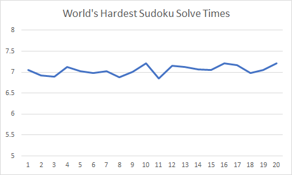

# Sudoku Solver 
Using [Backtracking](https://en.wikipedia.org/wiki/Backtracking)

## World's Hardest Sudoku
[Provided by Telegraph.co](https://www.telegraph.co.uk/news/science/science-news/9359579/Worlds-hardest-sudoku-can-you-crack-it.html)

## Solving Algorithm
Over 20 runs with the World's hardest sudoku, this program averages a solving time of 7.04 seconds.

